# PRODUCT AMANGEMENT AND AGENTIC AI BY IITPatna

## 03/05 Session -1

### What a Product manager actually does?

- Bridge between User, technology and Business
- Defines Produce Visison and stratergy aloigend with business goals and user needs
- Manages product roadmap - balancing stakeholders inputs
- Leads cross-functional teams
- Advocates for customer, ensuring product solves the problems

### Product Thinking:

- Focus on the problem and not the solution - why customer need this feature, what probelm does this solves
- Start with the WHY - user centric mindset. Think in terms of outcomes and user values and not just deleivering features.
- Understand user needs, pain points and jobs-to-be-done
- Define value proposition before building the product not after building the product

## How do user identify the product, how user learn to use it?

- CYCLE: launchin -> learning -> validating
- Need - Data and Evidence
- No.1 reason for startup failure - customer dont need it Value Propsition:

## How your product or service creates value for the customer

Tools: Value proposition canva - ensure fit between customer's profile and product offering
Solve this problem - for this user - by doing this

The Value Proposition Canvas is a strategic tool used to ensure a product or service
is aligned with what customers truly want.  
It has two key parts: 1. Customer Profile – outlines customer jobs, pains, and gains. 2. Value Map – shows your product’s pain relievers, gain creators, and products/services.  
The goal is to create a clear fit between what the customer needs and what your product offers.

Usecase: Uber eats Problem-Solution Fit:

- Ensure product is addressing real and clearly defined user problem or need
- Validate propsed solution solves the targeted problem effectively
- Ensure suffient user intrest in the solution
- Iterate these steps to improve to refine the problem and thus the solution (pain-relievers)
  This is an importan precursor to pursuing product-market fit

  

### NOTES:

A **Product Manager** owns the what and why of a product, defining its vision, user needs, roadmap and success metrics.
Meanwhile, a Project Manager owns the how and when, handling planning, scheduling, resource coordination and delivery
to ensure the work gets done on time, on budget, and within scope of the project.

A **Product Owner** is an Agile‐team role focused on tactical execution—owning the backlog,
refining user stories, and working day-to-day with developers to ensure the team builds the right features.
A Product Manager, by contrast, owns the strategic end-to-end vision—defining market opportunities, setting the roadmap,
aligning business goals, and measuring outcomes. They overlap on prioritization and stakeholder liaison,
but the PM’s remit is broader (vision, business case, metrics) while the PO’s is narrower (backlog management, sprint planning)

A PM finds the real problem through user interviews, data analysis and stakeholder discussions to write a clear problem statement.
Then they brainstorm and prototype solutions, run quick tests, prioritize the best approach, and lead the team to build,
launch and measure success

**Customer jobs** refer to the tasks or problems that a customer is trying to accomplish or solve in their life.
These can be functional (e.g., "I need to organize my schedule") or emotional (e.g., "I want to feel confident in my decisions").
Understanding customer jobs helps you design products or services that address those specific needs.

- **POC or MVP ? Which comes first ? Product Solution FIt means what POC or MVP?**
  - POC (Proof of Concept) comes first. It tests if your idea is technically possible.
  - MVP (Minimum Viable Product) comes after, it tests if users actually want it.

Product-Solution Fit usually happens at the MVP stage, when you've built something basic and see if it solves a real user problem.

---

**The Samosa Story: How a Snack Becomes a Hit Meet the team behind the samosa:**
Product Manager (PM): The team captain who dreams up what kind of samosa people will love.
They decide the big idea, like making a crunchy, tasty samosa with new flavors.

Product Owner (PO): The coach who breaks the big idea into smaller steps.
They make sure the team focuses on the most important tasks first, like perfecting the potato filling before trying cheese.

Product Developer: The chef who experiments with recipes, cooks, tastes, and improves samosas until they’re delicious.

Project Manager: The organizer who keeps everything on schedule. They make sure tasks get done, ingredients arrive, and
samosas reach the shops on time.

How it works:  
 The PM says, “Let’s create a new crunchy samosa everyone will love.”
 The Developer cooks and tests the samosas.  
The PO says, “First, perfect the potato filling, then try cheese.”  
 The Project Manager ensures the team has what they need & the samosas get delievered

---

## 06/05 Session - 2

## High Performance PM Mindset

### Job of the Product Manager:

Desirability - Do people want this?
Desirability signs - Rapid user adoption
High Engagement Metrices -> daily active, time spent in app
Social sharing

Feasibilty - Can we build this?
Includes technolgy, fetures, engineering talent anf ability to scale infrastructure as user grew

Viability - Can this be sustainable business?
Viability is proven by apps freemium model ( providing premium for free for some period)

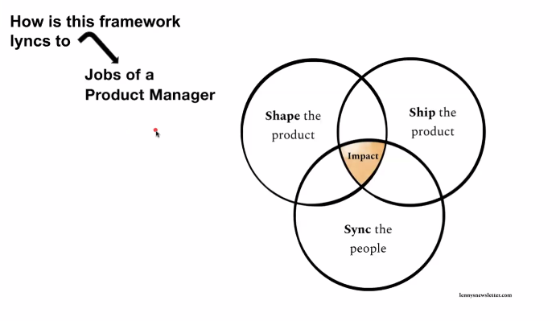

### SkillSet VS MindSet:

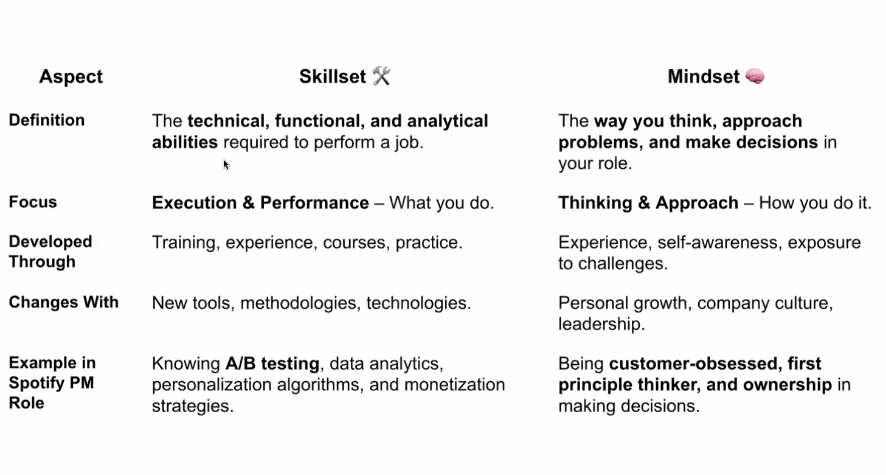

### What PM should take care of:

1. **Customer obsession over Stakeholder management** - Eg. Netflix from DVD-selling in mails to streaming lakhs of content

2. **Bias for Action over Analysis Paralysis** - Eg: Insta launching stories option in 8 months to cunter snapchat

3. **First Princples Thinking over Best Practices copying** - solving probles by starting with most basic, prven facts and building up from there,
   rather than following what everyone else does.
   Best practice -> follow what all do
   Eg: Elon Musk's SpaceX 90% reduced price in rocket launch price by manufacturingusing in-house components and create reusable rockets

4. **Systems Thinking over shotterm execution** - Eg: Airbnb create trust between complete strangers by user govt. ID verification,
   reviews from both customer and owners and other safty guidelines so they would feel comfortable

5. **Adaptable and Ownership over TaskExecution** - When plan fails, own the outcome and adapt

### Tech to PM Mindset transition:

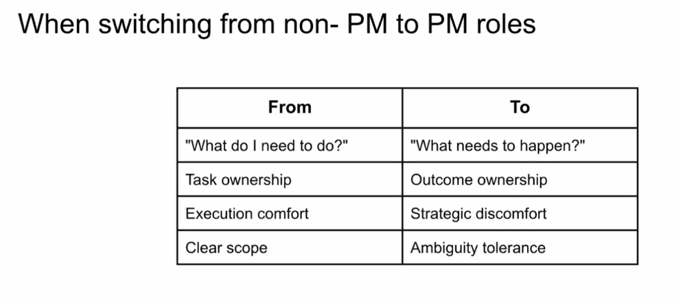

### NOTES:

Feasibility is about can we build it - do we have the tech, team, and tools?
Viability is about should we build it - will it make money or support the business long term?

In today’s trend, a product should aim to create real user impact - by solving meaningful problems, driving adoption, improving retention, and delivering measurable value.
That could mean saving users time, making something easier or more accessible, or unlocking a new habit or behavior.
The impact should be visible in both user satisfaction and business outcomes like growth, engagement, or revenue.

#### what is user aquisition cost vs lifetime value?

User acquisition cost (CAC) is how much you spend to get one new customer—like ad spend, marketing, and sales costs.

Lifetime value (LTV) is how much revenue you earn from that customer over their entire relationship with your product.
Ideally, LTV should be much higher than CAC to make the business sustainable.

---

## 07/05 Session - 3

## Decision making under ambiguity

### What is ambiguity in PM?

- Incomplete or Wrong information
- Confilicting signals - when different
  metrices or feed back point are in different direction
- Uncertain outcome - unpredictable
- Evolving context - rapdi change in user needs, market condition or technology

**_Im PM, we often make high-impact decisions with only 60-70% of information you wish you had_**

### Ambiguity mindset

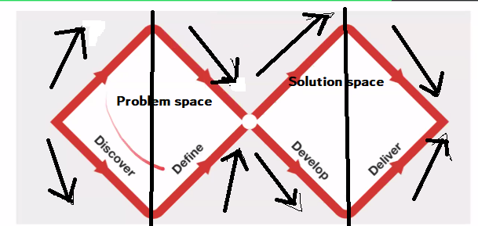
Double diamond diagram

- Explore problem widely
- Narrow problem statement
- Generate multiple solution option
- Refine to best specific solution

### Example - Netflix - Qwikster

Problem Space:

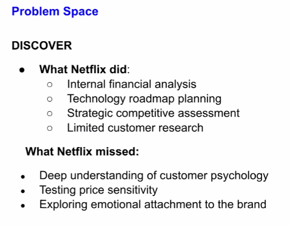 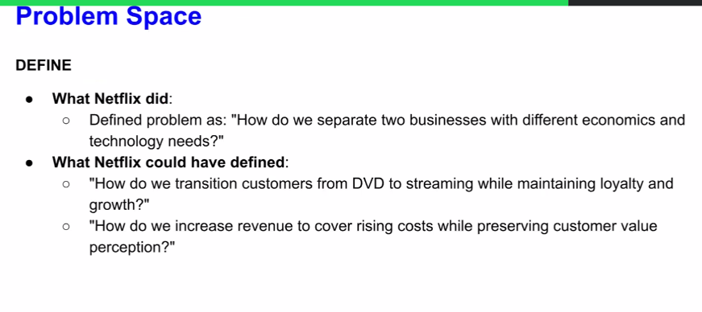

SolutionSpace:

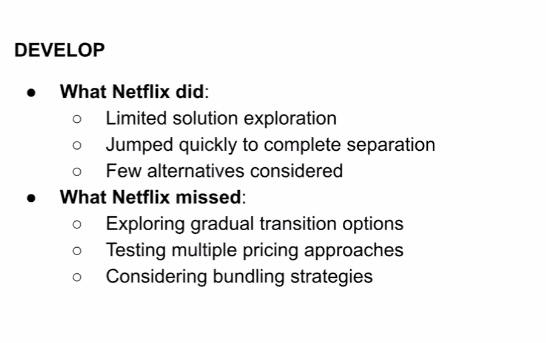
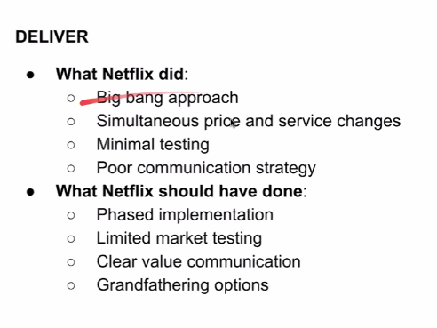

### Key pitfalls:

- Rushed trough discovery
- Narrow Problem definition - from product perspective and not from customer perspective
- Limited solution exploration
- poor delivery planning

### Example - Flipkart

Discover:
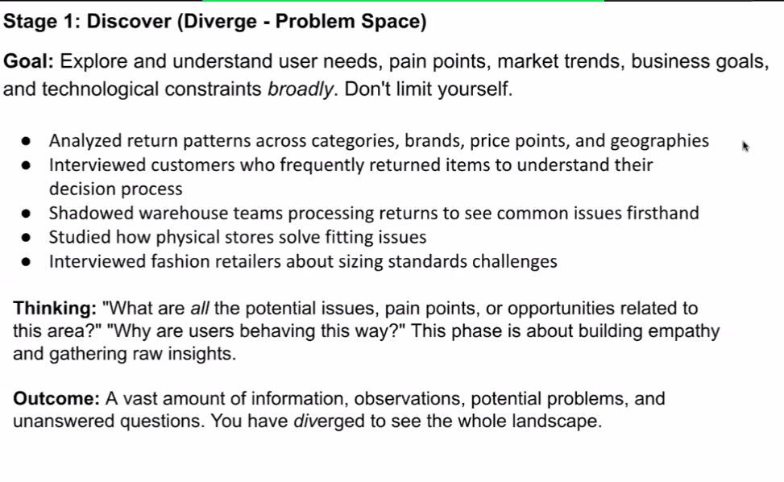

Define:
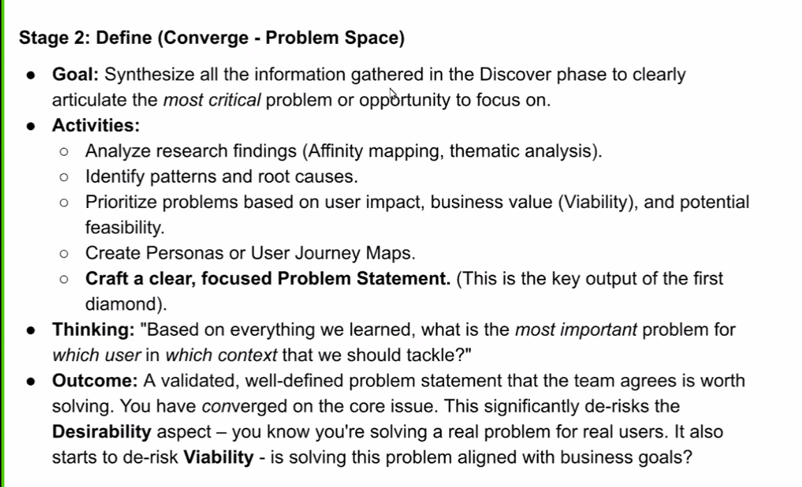

Develop:
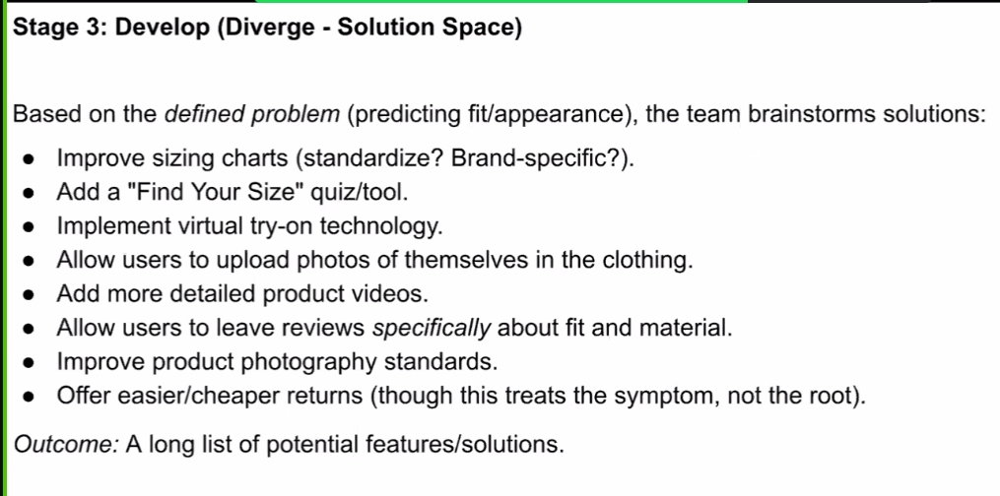

Deliver:
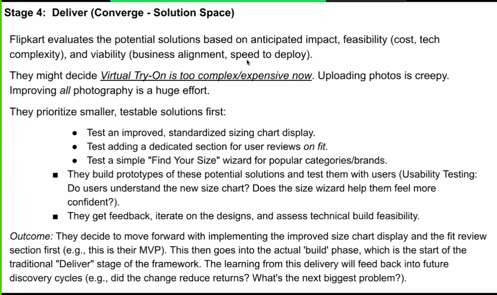

---

## 10/05  Session - 4

## Product Thinking and customer insight

###  JTBD Framework: - Job To BE Done
 - Identify funtional, emotional and social aspects of the job
 - Ask: When I ____ (situaton), I want to ___ (job), so I can ___(outcome)
 - Design your product to excel at specific job

### User Research - Why bother?

- Avoid building on assumptions
- Discover unment needs and apin points
- Valildate ideas early, save time later

#### How to do User research?

1. User Interviews - the why:
    - one-on-one communication
    - open ended question -> why , ask narrative question
    - listen > talk
    - 5 to 10 interviews 

2. Surveys -  to see patterns:
    - reach hundreds or thousands
    - Keep it short, general and clear
    - Do survey after Interviews
  
3. Observations/ Field studies - real world:
    - watch user in natural context
    - uncovers unspoken needs and workarounds
    - Eye opening

### Creating personas:

Putting a face to user and Synthesis the data collected from Interviews, Surveys and Observations

Fictional, research based archetypes represneting key user segments(broader group).

Humanize user data -> Empathy the data across team(dev, qa, DBA, Managers) -> Make product decision and prioritaztion
Whoes problem are we solving

#### Persona Anatomy:

Name, photo, short bio

Goals and motivations

Pain points and frustrations

behaviours & context

Quote that captures attitude/ behaviour

---

## 12/05 Session - 5

### Why product fail?
Lack of user reseach 

Lack of product market fit (PMF)

35% product failures are due to lack of user needs research

Desirablity connects with user in VDF framework

How well played out our user research is
 
 
### Data collection Approaches: 
#### Quantative research
 * Surveys
 * Web analytics - Eg. capture user login
* Usage metrics - DAU / MAU / churn rate 

#### Qualitative research
* User diaries or interviews or personas

* Focus groups -> in depth interviews in group belonging to same persona type

* In-dept interviews

### When to use what: 

#### Choose quantitative research when            
* numeric validation needed
* measure precise quantitites
* generalize findings to larger population
* Measuring conversion rates
* Tracking user engagement metrices
* Pricing analysis
* Performance benchmarking
* Trend identification

#### Choose qualification research when
* Depth of understanding required
* Explore complex behaviours
* Understand emotional motivations
* Nuanced user experiences
* early staged problem exploration
* new product concept validation
* Understanding user pain point
* Exploring unexpected user behaviours
* Designing user personas
* Service design challange

								   
CASE STUDY : Burbn to Instagram
Understanding user's goal | understanding user research | indentifying pportunities -> 

Key user problem discovered:
1. Techincal Barrrier ->  user wanted beautiful phonts but lacked photography skill -> so filter came 

2. Emotional need -> User wanted to express creativity and recieve validation -> likes and followers came

3. Speed Issue -> Existing photo sharing tool were slow -> upload photo once and be available any thime anywhere via cloud

4. Connecton desire -> share their lives with friends -> streaming or live videos 

5. Contet chalenge -> mobile photos were of low quality -> again filter comes handy

### Customer Journey Map:
 A visual representation of how user or customer interacts with your product. It maps out steps user go through to complete a specific task.
  Note : We have a template in Miro app for customer journey map.

Awarness stage ->               Consideration stage ->  Decision stage ->  onboarding and use stage ->  loyalty and advocate stage   

### Persona
CASE STUDY: Instagram user personas
                           
1. Visual Storyteller - who uses as visual diary and creative outlet
2. Social Connector - uses to stay connected with friends
3. Aspiring Influencer - seeks to build audience and monetize their content
4. Brand/ Business Owner - for marketing and customer engagement
5. Content Consumer - browse and consumes content
6. Community seeker - looks for like -minded inviduals around specific interests or hobbies
7. Visual Professional -  deisgners and artisits who showcase their work 

### personas contains : 
* Demographics: name, age, country
* psychographics : values, interest, personality, goals and aspirations, lifestyle
* behaviors : usage patterns (what user creates/posts), content preferences (what user consumes)
* needs and motivations - goals : core needs, motivation in using the product
* Pain points and frustuations : platform-related , usage-related
 
---
## 13/05 Session - 6
### Customer Journey map:
A. Awareness 
 * Introduces product to the potential customer
 * Generates initial interest

B. Consideration 
 * Evaluating different product or services

C. Decision
 * Decides to buy and complete tansactions

D. Onboarding/ Usage
 * Customer using the product or service

E. Advocacy
 * Satisfied customer recoomends brand to others 

### Questionnaire example for an interview
Introduction (3-5 minutes)
1. "Thanks for joining us today, Sophie. Could you briefly tell me about how Instagram fits into your creative life and
content creation routine?"

Current Content Creation Pattern (7-10 minutes)

2. "Walk me through the last time you created and shared content on Instagram. What was that process like from idea to
posting?"

3. "How do you typically decide which format to use for your content—whether it should be a photo post, a Story, or
something else?"

Reels Experience (10-15 minutes)

4. "I'd love to hear about your experience with Reels. Have you ever tried creating one? Could you tell me about that
experience?"

      Follow-ups: Explore barriers, comfort level, and specific friction points

5. Task observation: "Could you show me how you would go about creating a Reel right now? I'd love to see your
process and hear your thoughts as you go through it."

      Note key friction points, hesitations, and workarounds

Content & Technical Aspects (7-10 minutes)

6. "What types of content do you think would work well as Reels for your personal style or
aesthetic?"
7. "What aspects of creating Reels feel most challenging compared to other content formats you're
comfortable with?"

Ideal Experience (3-5 minutes)

8. "If Instagram could change one thing about Reels creation to make you want to create them more
often, what would that be?"

Closing (2-3 minutes)

9. "Is there anything important about your experience with Instagram content creation that we
haven't covered?"

NOTE: Questions are important -  timing for each questions is important - we as PM not talking or interrupting user of their opinion is important(Don't ask something like -  why havent you noticed this feature of us so far?) - dont influence the user - Dont do confirmation bias - Dont ask leading question - each question 5 mins max (as, attention span for human is 30 to 35 mins, so max 45 mins of interview ) - prepare the questionnarie - ask same questions to all the personas/users 

---

## 17/05 Session - 7
## From Insight to Strategy

### Problem -solution fit
Evidence that your concept meanningfully solves a high-value user problem

Happens before Product-Market Fit

Avoids polishing solution that nobody needs

Set foundation for credible roadmap

Its about solving the right problem for right people in a right manner

### Hardest part of Problem Framing
1. Getting users to articulate the pain
2. Prioritising among many pains
3. Writing a concise problem statement
4. Aligning stakeholders around one problem

### Template for crafting sharp prblem statement 

When __(user situation/ context)__
i need to  __(goal)__
but struggle because __(obstacle/ pain point)__
leading to __(undesirable outcome)__

### Signals you are near Prblem-Solution Fit
* User should say ___"Yes! that's my issue"___
* Early adopters accept prototype / concierge service
* Strong pull signals : sign ups, wait-lists, pre-pays
* clear metric improvements 

Once we found solution that fits the problem well. Next step is to find how big is the impact of the solution. Its done by "_sizing the pie / sizing the opportunity_"

### Why size the Pie?
* Connect user value wth business value
* Decide how big a bet idea deserves
* Set investor / leadership expectations

2 common approaches:
1. Top-down : TAM -> SAM -> SOM
2. Bottom-up : Price -> Customer -> Penetration

#### Top-down approach:
The total market is X billion dollars or X million people. We solve only a portion of that and we expect to capture a fraction of that portion

This approach to often understamd the theoretical maximum

TAM : Total Addressable Market -> everyone with the problem -> measured in annual revenue or potentail users.

SAM : Servicable available market -> segemtn reachable by ou model

SOM :  Servicable obtainable market -> share your aim to capture in 3-5 years

#### Bottom-up approach:

See what's actually achieveable with our plan

### Minimum Viable Product (MVP)

Smallest testable product that delivers core value to early adopters and maximises validated learning with least effort

#### Value vs Complexity Matrix 
The tool used for scoping MVP.

Here is an example of meal kit for this matrix

---

## 19/05 Session - 8
### Priortization frameworks 

#### Opportunity prioritization

1. JTBD Framework

    Identify core jobs
    Example:
    

    Once identifying core Job then find "Job Importance vs Current Satisfaction Assessment"

2. HEART framework

    **H**appiness -> measures how satisfed users are with the product via surveys, feedback forms

    **E**ngagement -> measures how actively users interact witht he product. 

    **A**doption -> measures how quickly and widely users adopt new features or the product as a whole 

    **R**etention -> measures how well the product retains users over time

    **T**ask Success -> measures how easily users can complete tasks using the product

#### Solution Prioritization

3. RICE 
  (Reach * Impact * Confidence) /
    Effort 

    Reach -> How many users will the product be visible to?

    Impact -> How much better or worse does it makes for each user?

    Confidence -> High Confidence | Medium Confidence | Low confidence 

    Effort -> How much time it will take to develope it

    Example - Instagram Reels:
    Solution #1:
    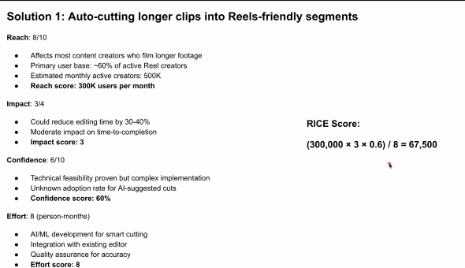
    Soultion #2:
    

    From these example solution RICE score is greater for Solution 2 and thus prioritize solution #2 first.

4. MoSCoW

    Must Have - Should Have - Can Have - Won't Have
    

---

## 20/05 Session - 9 

5. Kano 

User delight centric framework.

MVP:

Simple but usable version of a product that alllows a team to collect maximum validated learning with minimum effort.

Before building MVP you should have answers for the following:
1. Problem statement
2. Target users
3. Value Proposition
4. Solution Hypothesis
5. MVP Features
6. Success Criteria

USE CASE : Dropbox

1. Problem : File syncing was complicated and unreliable

    Vision : Simple file synchronizationacross devices
    
    Challenge : How to test without building the entire product?
2. Target User : Tech professionals, Students
3. Value Proposition : Seamless file access anywhere
4. Solution Hypothesis : simple drag and drop syn will delight user
5. MVP Features :  video demo
6. Success Criteria : High signup conversion, +ve feedback

KEY TAKEAWAY:
* MVP's are about leaning and not launching
* Choose right MVP tpe for specific needs
* Focus on core value
* Embrace Imperfection as strategy
* Creatvity can beat conventional approaches

---
